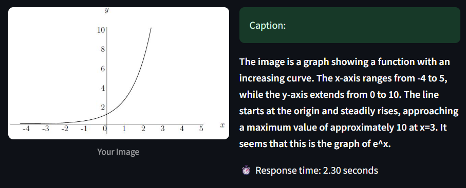

# SightMate - VQA Service

<div align="center">
  
</div>

A Visual Question Answering (VQA) microservice built with FastAPI and a hexagonal architecture pattern. This service provides endpoints for image captioning and question answering about images.

## 🏗️ Architecture

The project follows a hexagonal (ports and adapters) architecture pattern, which provides clear separation of concerns and makes the system highly extensible:

```
src/
├── api/           # API layer (FastAPI endpoints)
├── core/          # Core configuration
├── domain/        # Business logic and interfaces
│   ├── models/    # Domain models
│   └── ports/     # Abstract interfaces (ports)
└── infrastructure/# External implementations
    └── adapters/  # Concrete implementations of ports
```

### Ports & Adapters Pattern

The service uses a ports and adapters pattern for VQA functionality:

- **Port (`VqaPort`)**: Defines the interface for VQA operations:
  - `process_captioning()`: Generates captions for images
  - `process_question()`: Answers questions about images

- **Adapters**: Concrete implementations of the `VqaPort` interface
  - Currently supports VLM (Vision Language Model) adapter
  - New adapters can be easily added by implementing the `VqaPort` interface

### Adapter Registry Pattern

The project uses a registry pattern (`registry.py`) for managing VQA adapters:

```python
@register_adapter("adapter_name")
class NewVqaAdapter(VqaPort):
    # Implement the VqaPort interface
    pass
```

This makes it easy to:
- Register new VQA model implementations
- Switch between different VQA models
- Maintain multiple implementations simultaneously

## 🚀 API Endpoints

The service exposes the following REST endpoints:

### Health Check

**GET `/health`**
- Description: Health check endpoint to verify service status
- Response:
  ```json
  {
    "status": "ok"
  }
  ```

### Image Captioning

**POST `/vqa/captioning`**
- Description: Generates captions for uploaded images
- Request Body:
  ```json
  {
    "image": {
      "bytes": [/* array of image bytes */],
      "metadata": {
        // Optional metadata about the image
      }
    },
    "options": {
      // Optional configuration for the captioning process
    }
  }
  ```
- Response:
  ```json
  {
    "output": "Generated caption text",
    "details": {
      // Optional additional details about the captioning process
    }
  }
  ```

### Question Answering

**POST `/vqa/question`**
- Description: Answers questions about uploaded images
- Request Body:
  ```json
  {
    "image": {
      "bytes": [/* array of image bytes */],
      "metadata": {
        // Optional metadata about the image
      }
    },
    "question": "What color is the car?",
    "options": {
      // Optional configuration for the question answering process
    }
  }
  ```
- Response:
  ```json
  {
    "output": "Answer to the question",
    "details": {
      // Optional additional details about the question answering process
    }
  }
  ```

## 🛠️ Setup & Configuration

### 1. Clone the repository
```bash
git clone https://github.com/Almouhannad/SightMate-VQA-Service.git
cd SightMate-VQA-Service
```

### 2. Create a `.env` file

Create a `.env` file in the project root with the following variables (see [src/core/config.py](src/core/config.py) for details):

```env
# VQA model to use:
VQA_ADAPTER=vlm
# API Key repository to use (e.g. mongo_db, in-memory, ...)
API_KEY_REPOSITORY=mongo_db
LMS_API_BASE_URI_FOR_CONTAINER=your_gemma_api_base_uri  # Only needed if vlm

# MongoDB configuration
MONGO_HOST=mongo
MONGO_PORT=27017
MONGO_ROOT_USERNAME=your_mongo_root_username
MONGO_ROOT_PASSWORD=your_mongo_root_password
MONGO_DATABASE=your_database_name
# Application database and user
MONGO_DATABASE=vqa_service_database
MONGO_APP_USERNAME=vqa_service
MONGO_APP_PASSWORD=admin
MONGODB_URI=mongodb://${MONGO_APP_USERNAME}:${MONGO_APP_PASSWORD}@${MONGO_HOST}:${MONGO_PORT}/${MONGO_DATABASE}

# Mongo Express credentials
ME_USERNAME=admin
ME_PASSWORD=admin
```

### 3. Build and run with Docker Compose

Make sure you have [Docker](https://docs.docker.com/get-docker/) and [Docker Compose](https://docs.docker.com/compose/install/) installed.

Build and start all services (API, MongoDB, Mongo Express):

```bash
docker-compose up --build
```

- The API will be available at [http://localhost:9902](http://localhost:9902)
- Mongo Express UI will be available at [http://localhost:9802](http://localhost:9802)

## 🔌 Adding New VQA Models

To add a new VQA model adapter:

1. Create a new adapter class in `src/infrastructure/adapters/vqa/`:
```python
from src.domain.ports.vqa_port import VqaPort
from src.infrastructure.adapters.vqa.registry import register_adapter

@register_adapter("new_model")
class NewModelAdapter(VqaPort):
    def process_captioning(self, captioning_input):
        # Implement captioning logic
        pass

    def process_question(self, question_input):
        # Implement question answering logic
        pass
```

2. Update the `.env` file to use your new adapter:
```env
VQA_ADAPTER=new_model
```
## 📸 More Screenshots
<div align="center">
  
  <br><br>
  
</div>


## 🤝 Contributing

Contributions are welcome! Please feel free to submit a Pull Request.

## 🙏 Acknowledgments

- ChatGPT
- FastAPI for the fast API
- My brother who bought me a new laptop so I can run VLM locally :)
- My friends because they are supportive